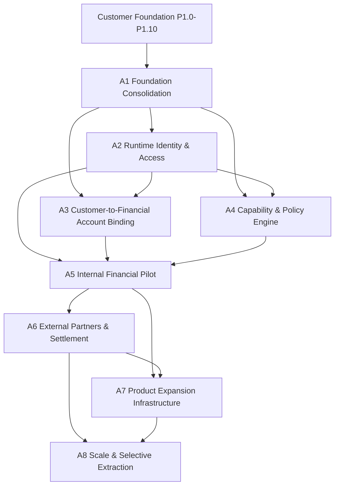

# Post-Customer-Foundation Dependency Graph

- **Task:** A1T08 — Canonical Ownership, Roadmap, and Dependency Package
- **Classification:** Documentation-only architecture synthesis
- **Application code, API, entity, migration, and configuration changes:** None

## Naming rule

This graph uses **Architecture phases A1-A8**. The Product Roadmap retains its original P1.0-P1.15 business-capability names. Product-to-Architecture mapping is maintained in [`ROADMAP.md`](ROADMAP.md). The ownership and prohibited-edge decisions are maintained in [`CANONICAL-OWNERSHIP-MATRIX.md`](CANONICAL-OWNERSHIP-MATRIX.md).

## 1. Complete project evolution

```text
M0-M9
  |
  v
Engineering & Financial Core
  |
  v
P1.0-P1.10
  |
  v
Customer Foundation
  |
  v
Architecture Phases A1-A8
  |
  v
Runtime activation
  |
  v
Product Roadmap continues P1.11-P1.15
```

## 2. Architecture phase graph



A3 and A4 may be designed in parallel after A1. A2 authorization and protected-route evidence remains a prerequisite to production activation, and A5 requires A2, A3, and A4 together. A6 and A7 may share approved contracts after the A5 pilot gate, while A8 requires measured scale/recovery evidence.

## 3. A1 task dependency graph

The optimized A1 tasks retain the exact sequence and merges defined by [`A1-IMPLEMENTATION-PLAN.md`](A1-IMPLEMENTATION-PLAN.md):

```text
A1T01 Baseline and ADR Inventory
  -> A1T02 Platform and Customer Foundation Inventory
  -> A1T03 Module, Schema, and API Inventory
  -> A1T04 Cross-Cutting Contract and Trust-Boundary Inventory
  -> A1T05 Customer and Adjacent Model Overlap Review
  -> A1T06 Risk, Eligibility, and Compliance Authority Review
  -> A1T07 Identifier, Privacy, and Retention Controls
  -> A1T08 Canonical Ownership, Roadmap, and Dependency Package
  -> A1T09 Reconstruct ADR-0012
  -> A1T10 Draft ADR-0020 and ADR-0021
  -> A1T11 Draft ADR-0022 and ADR-0023
  -> A1T12 Draft ADR-0024 Data Classification and Privacy
  -> A1T13 Consolidated Inventory and Cross-Document Consistency
  -> A1T14 A1 Review Package and Exit Evidence
```

The slash-separated review tasks in the canonical plan are completed before A1T08. A1T10, A1T11, and A1T12 may be designed in parallel after A1T08, but A1T13 waits for all three.

## 4. ADR-to-Architecture map

| ADR      | Decision                                                               | Architecture dependency |
| -------- | ---------------------------------------------------------------------- | ----------------------- |
| ADR-0001 | Domain-oriented, ledger-centred architecture                           | A1, A8                  |
| ADR-0002 | Minor-unit money and currency                                          | A3, A5, A6, A7          |
| ADR-0003 | Durable events and transactional publication                           | A5, A6, A7, A8          |
| ADR-0004 | Ledger-backed liability wallets                                        | A3, A5                  |
| ADR-0005 | Independent reconciliation                                             | A3, A5, A6, A7          |
| ADR-0006 | Controlled internal deposits and withdrawals                           | A5, A6                  |
| ADR-0007 | Non-money-moving expanded tooling                                      | A4, A6, A7              |
| ADR-0008 | Operational resilience primitives                                      | A2-A8                   |
| ADR-0009 | Production launch gates and runtime behavior                           | A2-A8                   |
| ADR-0010 | Production maturity and governed operations                            | A5-A8                   |
| ADR-0011 | Product governance                                                     | A1, A4, A6, A7          |
| ADR-0012 | Customer identity, profile, and KYC foundation; reconstructed          | A1, A2, A3, A4          |
| ADR-0013 | Customer onboarding and lifecycle                                      | A1, A4                  |
| ADR-0014 | Eligibility, limits, enrollment, permissions, restrictions             | A1, A4, A5              |
| ADR-0015 | Customer wallet provisioning metadata                                  | A1, A3                  |
| ADR-0016 | Funding-instrument metadata                                            | A1, A6                  |
| ADR-0017 | Beneficiary metadata                                                   | A1, A5, A6              |
| ADR-0018 | Customer preferences metadata                                          | A2, A6, A7              |
| ADR-0019 | Authentication and recovery metadata                                   | A1, A2                  |
| ADR-0020 | Foundation Closure and Scope Boundary; planned A1 draft                | A1 exit and A2-A8 gates |
| ADR-0021 | Customer Domain Canonical Model and Ownership Rules; planned A1 draft  | A1, A3-A5               |
| ADR-0022 | Risk, Compliance, and Eligibility Decision Authority; planned A1 draft | A4                      |
| ADR-0023 | Customer Identifier and Reference Conventions; planned A1 draft        | A2, A3, A5              |
| ADR-0024 | Customer Data Classification, Retention, and Privacy; planned A1 draft | A1, A2, A6              |

Planned ADR-0020 through ADR-0024 entries are dependency inputs and are not claims that the later ADR documents are already approved.

## 5. Data dependency graph

```text
Customer UUID and customer reference
  ├── Profile / identity / contacts / KYC evidence
  ├── Onboarding evidence
  │     └── Eligibility and product enrollment
  │           ├── Restrictions and limit profile
  │           └── Capability policy decision (A4)
  ├── Authentication metadata
  │     └── Runtime authentication and authorization (A2)
  ├── Compliance cases
  ├── Risk assessments and factors
  │     └── Capability & Policy Engine (A4)
  ├── Customer wallet metadata
  │     └── Customer-to-Financial Account Binding (A3)
  ├── Funding instruments
  ├── Beneficiaries
  ├── Preferences
  └── Identifier, privacy, retention, and legal-hold controls

Capability policy + authorization + account binding
  └── Customer-aware financial command (A5)
        ├── Idempotency
        ├── Ledger posting
        ├── Transactional outbox
        ├── Audit and operational evidence
        └── Independent reconciliation
```

Customer references, wallet aliases, case numbers, beneficiary/funding references, payment references, provider references, and correlation IDs are lookup or traceability values. They do not replace the Customer UUID, wallet/ledger IDs, or ledger source of financial truth.

## 6. Product dependency summary

| Product milestone                          | Required Architecture phases    |
| ------------------------------------------ | ------------------------------- |
| P1.0 Product, Regulatory & Launch Envelope | M0-M9 and A1 governance closure |
| P1.1 Identity & Customer Accounts          | A1-A3                           |
| P1.2 KYC & Compliance                      | A1, A2, A4                      |
| P1.3 Customer Wallet Experience            | A1-A5                           |
| P1.4 Risk & Fraud                          | A1, A2, A4                      |
| P1.5 Banking Rails & Settlement            | A1-A6                           |
| P1.6 Provider-backed Virtual Accounts      | A1-A7                           |
| P1.7 Notifications & Background Jobs       | A1, A2, A5-A7                   |
| P1.8 Support, Reporting & Operations       | A1-A8                           |
| P1.9 Customer Web Portal                   | A1-A5, A7                       |
| P1.10 Admin & Operations Portal            | A1-A7                           |
| P1.11 Public APIs & Partner Platform       | A1-A8                           |
| P1.12 Cloud, Security & Observability      | A1, A2, A6-A8                   |
| P1.13 Android, iOS & PWA                   | A1-A5, A7                       |
| P1.14 Controlled Pilot Launch              | A1-A8                           |
| P1.15 Product Expansion                    | A1-A8                           |

## 7. Missing or unsafe edges

- Customer UUID to ledger account: not canonical yet; A3 must create the binding and reconciliation contract.
- Authentication metadata to runtime access control: not implemented; A2 owns the trust boundary.
- Risk assessments to eligibility/policy decisions: source authority is split by purpose; A1 defines ownership and A4 defines decision precedence.
- Customer beneficiaries to transfer commands: metadata is not authorization; A5 consumes an approved recipient contract.
- Funding instruments to external settlement: metadata only; A6 owns provider and settlement mapping.
- Preferences to notification delivery: intentionally disconnected until A7 notification architecture.
- Compliance cases to policy decisions: case metadata only; A4 consumes evidence through a defined contract.
- Identifier/privacy controls to external processing: A1 defines inputs; A2/A6 must enforce access and partner boundaries.
- Outbox facts to external publication: durable storage exists, but publisher/inbox and external delivery remain future work.

## 8. Prohibited dependency edges

No Architecture phase may create a direct dependency from:

- Customer metadata to ledger balance or journal mutation.
- A reference, correlation ID, or provider ID to authorization or financial truth.
- Preferences to notification delivery before A7 notification architecture.
- Funding instruments to banks before A6 partner and settlement architecture.
- Beneficiaries to transfer execution before A5.
- Risk records to automated AML, sanctions, fraud, or transaction-monitoring decisions without separately approved policy architecture.
- Compliance cases to an implied automated screening result.
- Authentication metadata to unprotected runtime authorization.
- Operations dashboards, metrics, readiness, or reconciliation reports to source-record mutation.
- External partner payloads to unrestricted customer, credential, risk, compliance, or ledger data.

## 9. A1T08 acceptance evidence

- [x] A1 is shown before A2-A8.
- [x] A3 and A4 parallel design after A1 is explicit.
- [x] A5 requires A2, A3, and A4.
- [x] A1T01-A1T14 sequencing and the canonical merge decisions are preserved.
- [x] ADR-0001 through ADR-0019 and planned ADR-0020 through ADR-0024 are mapped to phases.
- [x] Product Roadmap P1.0-P1.15 names remain exact.
- [x] Prohibited edges are documented.
- [x] No application code, API, schema, migration, module, or runtime configuration is introduced.
