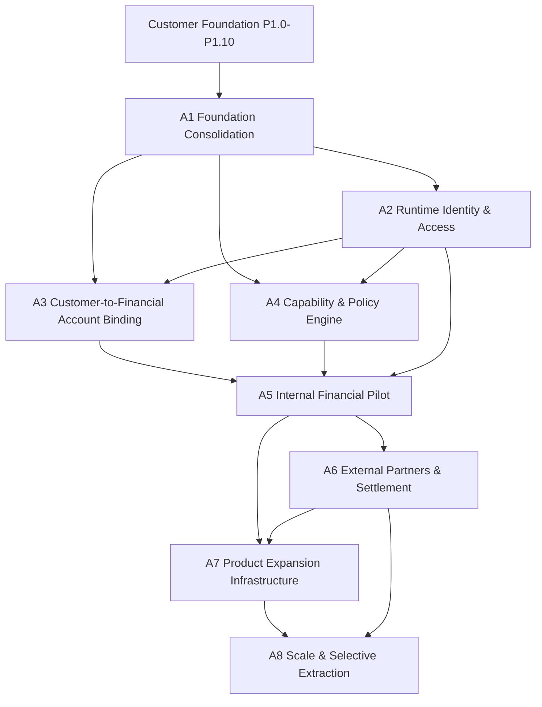

# Post-Customer-Foundation Dependency Graph

## Naming rule

This graph uses **Architecture phases A1-A8**. The Product Roadmap retains its original P1.0-P1.15 business-capability names. Product-to-Architecture mapping is maintained in [`ROADMAP.md`](ROADMAP.md).

## 1. Complete project evolution

```text
M0-M9
  |
  v
Engineering & Financial Core
  |
  v
P1.0-P1.10
  |
  v
Customer Foundation
  |
  v
Architecture Phases A1-A8
  |
  v
Runtime activation
  |
  v
Product Roadmap continues P1.11-P1.15
```

## 2. Architecture phase graph



A3 and A4 may be designed in parallel after A1, but A5 requires both.

## 3. ADR-to-Architecture map

| ADR      | Decision                                                   | Architecture dependency |
| -------- | ---------------------------------------------------------- | ----------------------- |
| ADR-0001 | Domain-oriented, ledger-centred architecture               | A1, A8                  |
| ADR-0002 | Minor-unit money and currency                              | A3, A5, A6, A7          |
| ADR-0003 | Durable events and transactional publication               | A5, A6, A7, A8          |
| ADR-0004 | Ledger-backed liability wallets                            | A3, A5                  |
| ADR-0005 | Independent reconciliation                                 | A3, A5, A6, A7          |
| ADR-0006 | Controlled internal deposits and withdrawals               | A5, A6                  |
| ADR-0007 | Non-money-moving expanded tooling                          | A4, A6, A7              |
| ADR-0008 | Operational resilience primitives                          | A2-A8                   |
| ADR-0009 | Production launch gates and runtime behavior               | A2-A8                   |
| ADR-0010 | Production maturity and governed operations                | A5-A8                   |
| ADR-0011 | Product governance                                         | A1, A4, A6, A7          |
| ADR-0012 | Customer Identity/Profile/KYC Foundation, reconstructed    | A1, A2, A4              |
| ADR-0013 | Customer onboarding and lifecycle                          | A1, A4                  |
| ADR-0014 | Eligibility, limits, enrollment, permissions, restrictions | A1, A4, A5              |
| ADR-0015 | Customer wallet provisioning metadata                      | A1, A3                  |
| ADR-0016 | Funding-instrument metadata                                | A1, A6                  |
| ADR-0017 | Beneficiary metadata                                       | A1, A5, A6              |
| ADR-0018 | Customer preferences metadata                              | A2, A6, A7              |
| ADR-0019 | Authentication and recovery metadata                       | A1, A2                  |

## 4. Data dependency graph

```text
Customer UUID
  ├── Profile / identity / contacts
  ├── Onboarding evidence
  │     └── Eligibility and product enrollment
  │           ├── Restrictions and limit profile
  │           └── Capability policy decision
  ├── Authentication metadata
  │     └── Runtime authentication and authorization (A2)
  ├── Compliance cases
  ├── Risk assessments
  │     └── Capability & Policy Engine (A4)
  ├── Customer wallet metadata
  │     └── Customer-to-Financial Account Binding (A3)
  ├── Funding instruments
  ├── Beneficiaries
  └── Preferences

Capability policy + authorization + account binding
  └── Customer-aware financial command (A5)
        ├── Idempotency
        ├── Ledger posting
        ├── Transactional outbox
        └── Independent reconciliation
```

## 5. Product dependency summary

| Product milestone                          | Required Architecture phases    |
| ------------------------------------------ | ------------------------------- |
| P1.0 Product, Regulatory & Launch Envelope | M0-M9 and A1 governance closure |
| P1.1 Identity & Customer Accounts          | A1-A3                           |
| P1.2 KYC & Compliance                      | A1, A2, A4                      |
| P1.3 Customer Wallet Experience            | A1-A5                           |
| P1.4 Risk & Fraud                          | A1, A2, A4                      |
| P1.5 Banking Rails & Settlement            | A1-A6                           |
| P1.6 Provider-backed Virtual Accounts      | A1-A7                           |
| P1.7 Notifications & Background Jobs       | A1, A2, A5-A7                   |
| P1.8 Support, Reporting & Operations       | A1-A8                           |
| P1.9 Customer Web Portal                   | A1-A5, A7                       |
| P1.10 Admin & Operations Portal            | A1-A7                           |
| P1.11 Public APIs & Partner Platform       | A1-A8                           |
| P1.12 Cloud, Security & Observability      | A1, A2, A6-A8                   |
| P1.13 Android, iOS & PWA                   | A1-A5, A7                       |
| P1.14 Controlled Pilot Launch              | A1-A8                           |
| P1.15 Product Expansion                    | A1-A8                           |

## 6. Missing or unsafe edges

- Customer UUID to ledger account: not canonical yet; A3.
- Authentication metadata to runtime access control: not implemented; A2.
- Risk assessments to eligibility/policy decisions: overlapping authority; A1/A4.
- Customer beneficiaries to transfer commands: not authorized or connected; A5.
- Funding instruments to external settlement: metadata only; A6.
- Preferences to notification delivery: intentionally disconnected until A7.
- Compliance cases to policy decisions: case metadata only until A4.

## 7. Prohibited dependency edges

No Architecture phase may create a direct dependency from:

- Customer metadata to ledger balance mutation.
- Preferences to notification delivery before A7 notification architecture.
- Funding instruments to banks before A6 partner and settlement architecture.
- Beneficiaries to transfer execution before A5.
- Risk records to automated AML, sanctions, or fraud decisions without separately approved policy architecture.
