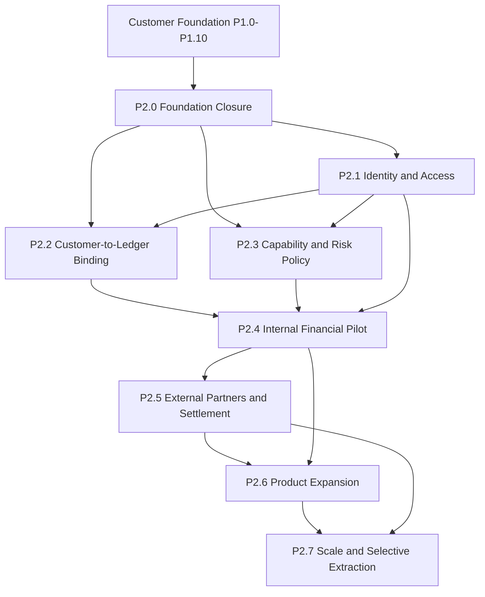

# Post-Customer-Foundation Dependency Graph

## 1. Phase graph



P2.2 and P2.3 may be designed in parallel after P2.0, but P2.4 requires both.

## 2. ADR-to-phase map

| ADR      | Decision                                                   | Primary dependency phase |
| -------- | ---------------------------------------------------------- | ------------------------ |
| ADR-0001 | Domain-oriented, ledger-centred architecture               | P2.0, P2.7               |
| ADR-0002 | Minor-unit money and currency                              | P2.2, P2.4, P2.5, P2.6   |
| ADR-0003 | Durable events and transactional publication               | P2.4, P2.5, P2.6, P2.7   |
| ADR-0004 | Ledger-backed liability wallets                            | P2.2, P2.4               |
| ADR-0005 | Independent reconciliation                                 | P2.2, P2.4, P2.5, P2.6   |
| ADR-0006 | Controlled internal deposits and withdrawals               | P2.4, P2.5               |
| ADR-0007 | Non-money-moving expanded tooling                          | P2.3, P2.5, P2.6         |
| ADR-0008 | Operational resilience primitives                          | P2.1-P2.7                |
| ADR-0009 | Production launch gates and runtime behavior               | P2.1-P2.7                |
| ADR-0010 | Production maturity and governed operations                | P2.4-P2.7                |
| ADR-0011 | Product governance                                         | P2.0, P2.3, P2.5, P2.6   |
| ADR-0012 | Customer Identity/Profile/KYC Foundation, reconstructed    | P2.0, P2.1, P2.3         |
| ADR-0013 | Customer onboarding and lifecycle                          | P2.0, P2.3               |
| ADR-0014 | Eligibility, limits, enrollment, permissions, restrictions | P2.0, P2.3, P2.4         |
| ADR-0015 | Customer wallet provisioning metadata                      | P2.0, P2.2               |
| ADR-0016 | Funding-instrument metadata                                | P2.0, P2.5               |
| ADR-0017 | Beneficiary metadata                                       | P2.0, P2.4, P2.5         |
| ADR-0018 | Customer preferences metadata                              | P2.1, P2.5, P2.6         |
| ADR-0019 | Authentication and recovery metadata                       | P2.0, P2.1               |

## 3. Data dependency graph

```text
Customer UUID
  ├── Profile / identity / contacts
  ├── Onboarding evidence
  │     └── Eligibility and product enrollment
  │           ├── Restrictions and limit profile
  │           └── Capability policy decision
  ├── Authentication metadata
  │     └── Runtime authentication and authorization
  ├── Compliance cases
  ├── Risk assessments
  │     └── Capability policy decision
  ├── Customer wallet metadata
  │     └── Customer-to-ledger account binding
  ├── Funding instruments
  ├── Beneficiaries
  └── Preferences

Capability policy + authorization + account binding
  └── Customer-aware financial command
        ├── Idempotency
        ├── Ledger posting
        ├── Transactional outbox
        └── Independent reconciliation
```

## 4. Missing or unsafe edges

- Customer UUID to ledger account: not canonical yet.
- Authentication metadata to runtime access control: not implemented.
- Risk assessments to eligibility/policy decisions: overlapping authority.
- Customer beneficiaries to transfer commands: not authorized or connected.
- Funding instruments to external settlement: metadata only.
- Preferences to notification delivery: intentionally disconnected.
- Compliance cases to policy decisions: case metadata only.

## 5. Prohibited dependency edges

No phase may create a direct dependency from:

- Customer metadata to ledger balance mutation.
- Preferences to notification delivery before notification architecture.
- Funding instruments to banks before partner and settlement architecture.
- Beneficiaries to transfer execution before P2.4.
- Risk records to automated AML/sanctions/fraud decisions without separately approved policy architecture.
